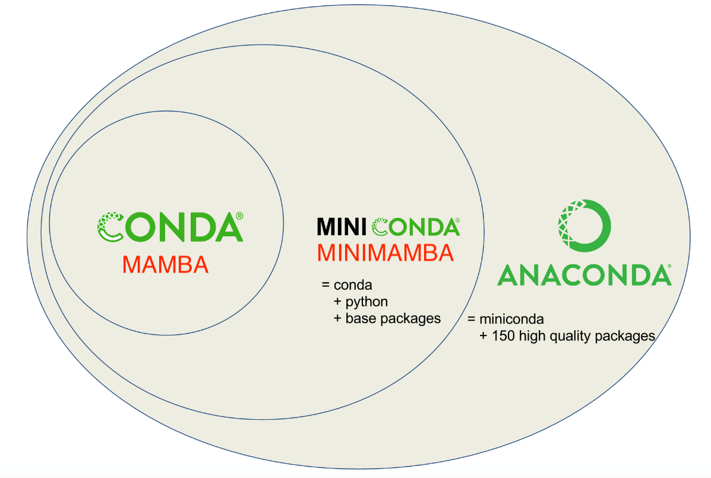

# Anaconda

In order to maintain all of your packages correctly some form of environment control is required. Anaconda is a commonly used package manager, which takes care of organizing package management to reduce conflicts. Anaconda comes in multiple forms, the versions on Biowulf, Conda and Mamba, are somewhat interchangeable. 

- Anaconda: The commercial version, comes with a graphical interface
- Conda: Anaconda but can run in terminal, allows access to other package channels
- Mamba: C++ reimplementation of Conda, a little faster

## Install Conda/Mamba 

Conda is easily installed on Biowulf by in terminal first by loading `mamba_install` then running `mamba_install`:

> module load mamba_install

> mamba_install --init-only --shell=bash /data/$USER/conda/

Now conda is accessible through terminal, activate Conda/Mamba with:

> source myconda

This will need to be run each time you start a new interactive session on Biowulf. To have Conda/Mamba running each time you start a new implementation see the [Biowulf in-depth guide](https://hpc.nih.gov/docs/diy_installation/conda.html). Now we are able to start creating Conda environments.

## Create an Conda environment

Creating a new environment is relatively easy. It always starts with `conda create -n env_name`. If you want to packages as you create the environment, add a list of the package names (MAKING SURE THEY ARE THE CORRECT NAMES!):

> conda create -n my_first_conda numpy scipy matplotlib seaborn biopython pysam ipykernal pandas

Activate your anaconda environment once everything is done installing with:

> conda activate my_first_conda

Now you can run code, either interactively with python or as the environment of a [snakemake](snakemake.md) rule. A good way to save your environment is by exporting to a `.yaml` (YAML Ain't Markup Language) file, which documents the versions of package in the current environment. Just make sure the desired Conda environment in activated in terminal first.

> conda env export > my_first_conda.yaml

From a `.yaml` file anyone can replicate the environment. Unfortunately, code does break and change, so the environment you save may not be reproducible if a long period of time has passed since `.yaml` creation. To make a more permanent environment, see the tutorial for [singularity](singularity_page.md) containers.