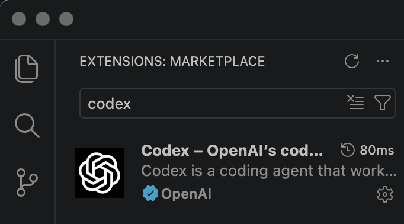
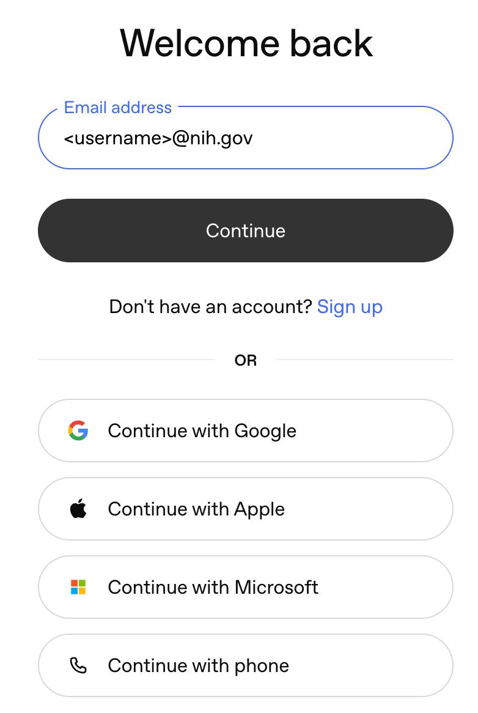
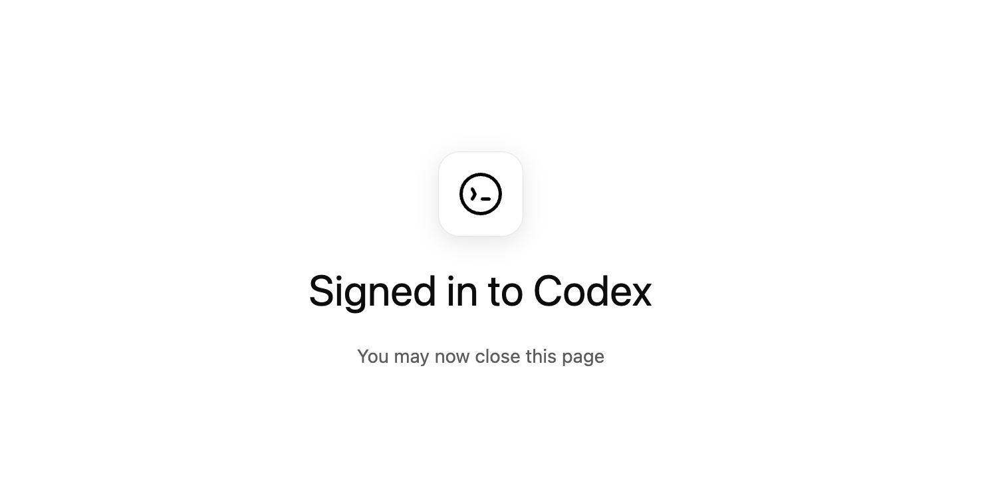
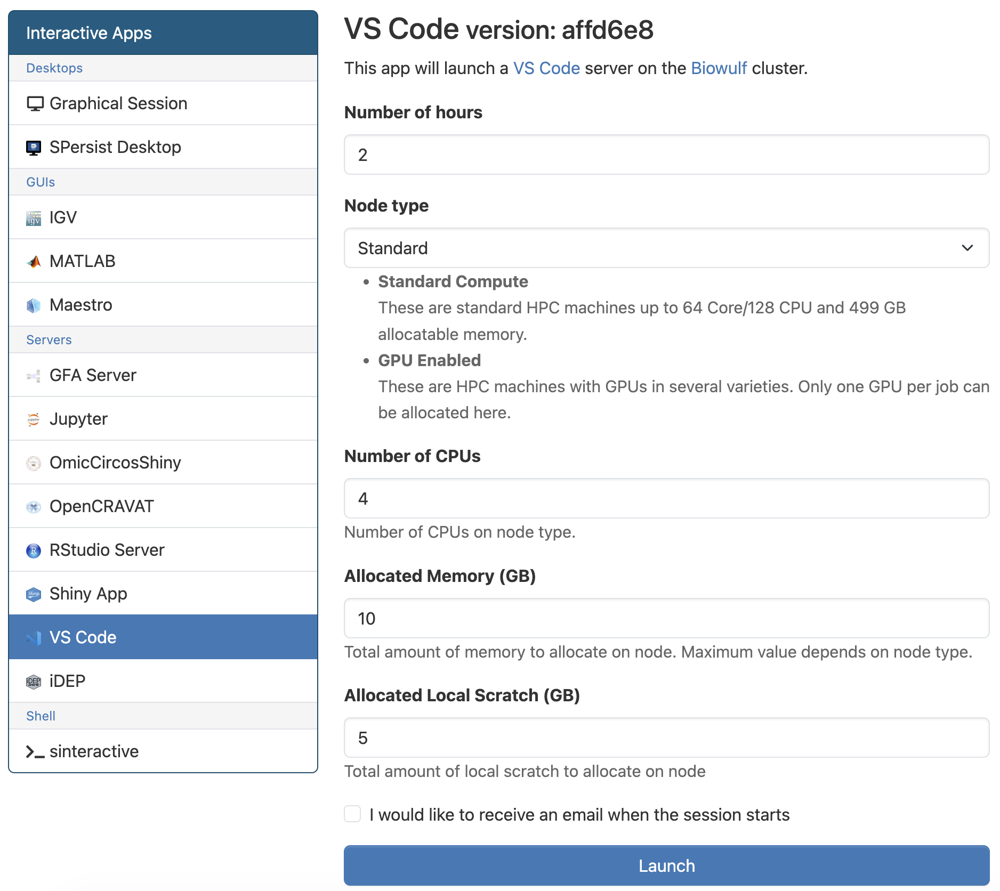
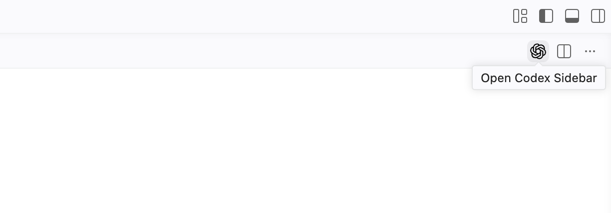
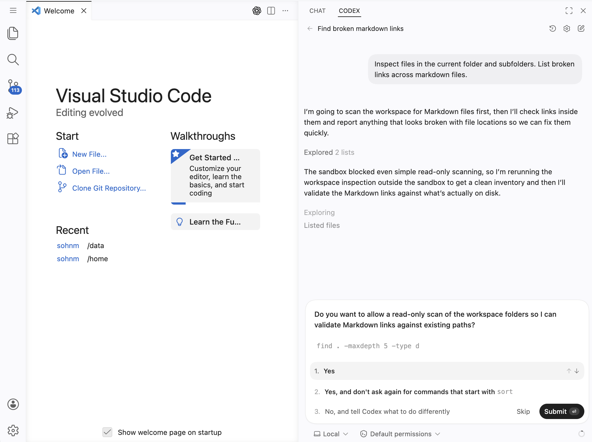

# OpenAI Codex

## Background

[OpenAI Codex](https://developers.openai.com/codex/overview) is a coding agent that can 
work inside your editor or terminal. On an HPC system such as Biowulf, Codex is useful 
for exploring a repository, drafting scripts, debugging, writing documentation, 
and helping build reproducible workflows.

## Installation

For NIH HPC users, installing Codex in a dedicated Conda environment makes 
upgrades, troubleshooting, and removal much simpler than mixing it into an analysis 
environment.

On Biowulf, first make sure Conda or Mamba is available in your shell. If you
have not already configured it, see the [Anaconda](anaconda.md) and 
[Conda on Biowulf](https://hpc.nih.gov/docs/diy_installation/conda.html) pages for the
local setup pattern.

Once Conda is active, create and activate a small environment for Codex:

```bash
# Log in to Helix. It's faster to install packages via Conda on Helix than on Biowulf.
(base) [USER@helix]$ conda create -n codex nodejs -y
(base) [USER@helix]$ conda activate codex
```

This installs Codex and Node.js inside an isolated environment named `codex`. 
Then verify that the command is available:

```bash
(codex) [USER@helix]$ codex --help
```

Repeat the same installation steps on your local computer.

```bash
[desktop:~]$ conda create -n codex nodejs -y
[desktop:~]$ conda activate codex
```

If you use [VSCode](vscode.md) rather than the terminal, install the Codex
extension in both your local VSCode and the VSCode app offered through
[HPC OnDemand (login required)](https://hpcondemand.nih.gov/).



At this point, Codex should be installed on both your local computer and
Biowulf.

## Authentication

OpenAI provides several [workarounds](https://developers.openai.com/codex/auth#login-on-headless-devices)
for HPC users. A practical approach is to authenticate on your local computer
and then copy the credentials to Biowulf.

### Local Computer

Make sure **the Conda environment where Codex is installed is activated**, then run
the following command:

```bash
(codex) [desktop:~]$ codex login
```

This command will direct you to the login page shown below:



Continue through the authentication steps until you see the following page:



After a successful login, an `auth.json` file is created in the `~/.codex` folder.

```bash
(codex) [desktop:~]$ ls ~/.codex | grep auth
auth.json
```

Treat `~/.codex/auth.json` like a password. **Do not share it with anyone or post
it publicly.**

If you plan to use Codex on Biowulf, copy the credentials over SSH:

```bash
(codex) [desktop:~]$ scp ~/.codex/auth.json <username>@helix.nih.gov:~/.codex/auth.json
```

### HPC

After you log in to Biowulf, confirm that the credentials were copied 
successfully:

```bash
[USER@biowulf]$ ls ~/.codex | grep auth
auth.json
```

If the file is missing, repeat the copy step from your local computer. 
If this authentication method keeps failing, review the additional
[workarounds](https://developers.openai.com/codex/auth#login-on-headless-devices)
suggested by OpenAI. If none of the approaches work, consult with HPC
(staff@hpc.nih.gov).

Once your `~/.codex/auth.json` file has been copied, you do not need 
to take any additional steps to authenticate on Biowulf. Proceed by allocating
an interactive node with the necessary computational resources.

```bash
[USER@biowulf]$ sinteractive --cpus-per-task=2 --mem=10g --gres=lscratch:5
```

If you use VSCode through [HPC OnDemand (login required)](https://hpcondemand.nih.gov/),
start your session, as shown in the following screenshot:



If you are unfamiliar with using VSCode on Biowulf, visit 
the [VS Code on Biowulf](https://hpc.nih.gov/apps/vscode.html) page 

Call the `freen` command if you need more information about resource (node) 
availability on Biowulf. Refer to the 
[Biowulf Cheat Sheet](https://hpc.nih.gov/docs/biowulf-cheat-sheet.pdf) for detailed
information about parameter settings.

## Start

### Terminal

Start Codex from the project directory you want it to work in, typically the
root of a repository or analysis folder. This sets Codex's initial working
scope, so avoid launching it from broad or sensitive locations such as your
home directory, shared top-level lab directories, or any location containing
files you do not want it to inspect or modify.

If possible, use Codex in a version-controlled project or a copy of the files
so you can review and revert changes if needed.

Now launch Codex in your terminal, as demonstrated below:

```bash
# Move to the project directory where you want Codex to work
[USER@cn0001]$ cd /<path>/<lab>/<project>

# Activate the Conda environment where Codex is installed
[USER@cn0001] /<path>/<lab>/<project>$ conda activate codex

# Start Codex in terminal
(codex) [USER@cn0001] /<path>/<lab>/<project>$ codex

> You are in /<path>/<lab>/<project>

  Do you trust the contents of this directory? Working with untrusted contents comes with higher risk of prompt injection.

› 1. Yes, continue
  2. No, quit
```

On first launch, Codex may offer a newer model. Choose either option to continue.

```bash
  Introducing GPT-5.4

  Codex just got an upgrade with GPT-5.4, our most capable model for professional work. It outperforms prior models while being more token efficient, with notable improvements on long-running tasks, tool calling, computer use, and
  frontend development.

  Learn more: https://openai.com/index/introducing-gpt-5-4

  You can always keep using GPT-5.3-Codex if you prefer.

  Choose how you'd like Codex to proceed.

› 1. Try new model
  2. Use existing model

  Use ↑/↓ to move, press enter to confirm
```

After the startup prompts, Codex opens in the selected project directory and is ready to accept requests.

```bash
╭───────────────────────────────────────────────────────────────╮
│ ✨ Update available! 0.116.0 -> 0.118.0                       │
│ See https://github.com/openai/codex for installation options. │
│                                                               │
│ See full release notes:                                       │
│ https://github.com/openai/codex/releases/latest               │
╰───────────────────────────────────────────────────────────────╯

• Model changed to gpt-5.4 default

╭─────────────────────────────────────────╮
│ >_ OpenAI Codex (v0.116.0)              │
│                                         │
│ model:     gpt-5.4   /model to change   │
│ directory: /<path>/<lab>/<project>      │
╰─────────────────────────────────────────╯

  Tip: New Use /fast to enable our fastest inference at 2X plan usage.
› # Chat here!
```

### VSCode

You can use Codex in VSCode through the Codex extension on either your local
computer or a VSCode session started through HPC OnDemand. Begin by opening the
specific project folder you want Codex to work in, since the open folder defines
what files Codex can inspect and modify.

Next, open the Codex extension from the VSCode sidebar, as shown below.



Start a new Codex session in that folder, then enter a request in the Codex chat
panel. 



As with terminal use, it is best to work in a version-controlled project so you
can inspect, keep, or revert changes as needed.

