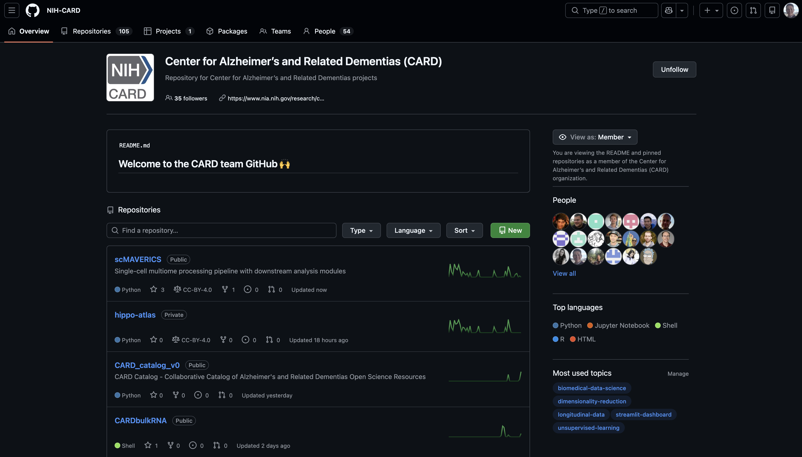
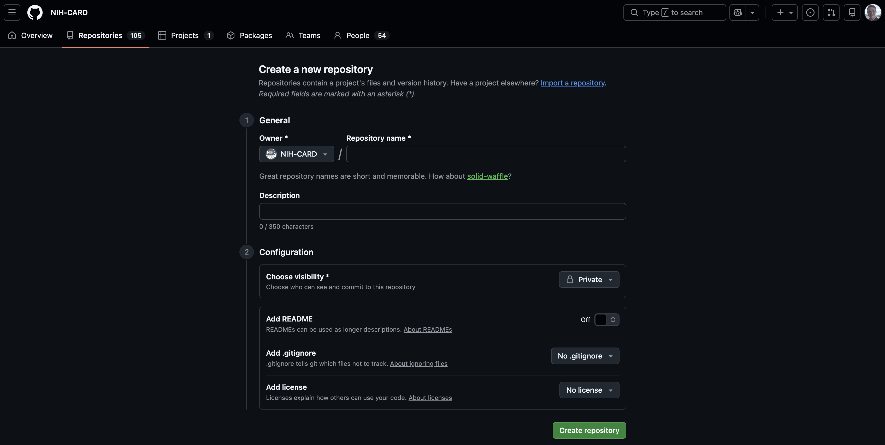

# GitHub

Whether you are just starting out in programming/bioinformatics, have been coding a while, or can remember [when C++ first came out](https://www.stroustrup.com/bs_faq.html#invention), GitHub should be where you are storing your code in a version-controlled manner. Don't feel like everyone will immediately see every changes you make, as your repositories can be made private, or you can use Git locally and never save your code online. But if you want your bioinformatic abilities to be recognized by other scientists, GitHub is where they will look. 

For clarity, **Git** is the program that tracks local changes on your machine and interfaces with **GitHub** which is where changes are stored where others can see.

## Logging in


Go to [GitHub.com](https://www.github.com) and sign up with an account (unless you plan on using your account for NIH work, then see the next section). Create a new account with a unique name. It is wise to turn on two factor authentication since you will be using this account on Biowulf. 

To log into your account on Biowulf first get a VSCode session running, then click on the profile icon at the bottom right of the screen, right about the settings icon. From there you can login and now track, push, and pull updates from where you work on projects. You may need to access GitHub from terminal as well; connect your account to your actions in VSCode with:

`git config --global user.name "Your Username"`  
`git config --global user.email "your_email@example.com"`

## Connect NIH email to existing account

NIH employees, fellows, and contractors have access to GitHub via the [STRIDES Initiative](https://cloud.nih.gov/resources/github/). For NIH users, it is *highly* recommended that you [link your GitHub account to your NIH email.](https://github.nih.gov/start/account#step-3-link-your-nih-account) If you don't already have an account, it is also recommended to use your NIH email for creating your account that will be used for NIH-specific projects.

## Create your first repo

To create a repository, first navigate to your or your organization's GitHub web account. For example, I work with NIA-CARD, so I will build repositories through the [NIA-CARD organization page](https://github.com/NIH-CARD). For either your account or an organization, create a new repository by clicking the green *New* button.



This will take you to a new repository where you can add a name (make it clear, catchy, and concise), a brief description, and then a few options to select 



### Visibility

Best to keep the project not visible until you are ready to share it with the world. Other GitHub users can still be invited to collaborate (by adding them as a collaborator in the settings page) but it gives control to who else can view, fork, and make pull requests. It takes a minute to get functioning code working.

### README

It is imperative that you have a clear README. The first thing you saw when you came to this site/repo was the README. Assume another programmer/scientist just came across your page and knows nothing besides they might want to use (and cite!) your code. Explaining what, how, and why your code does what it does in a readible format can be the difference between others using and acknowledging your code. Plus, a README is easy to write in Markdown and has a bunch of optional integrations with picture and link embedding, tables, lists, and making it pretty. Here is quick jump-start to [writing in Markdown](https://www.markdownguide.org/cheat-sheet/).

### .gitignore

Not everything in your project folder needs or should be tracked. GitHub has file size limits (don't try to store anything bigger than a few Mbs) or number of file limits. There are other specialized repositories to store raw data, intermediary files, environments, or figures. 

.gitignore is a simple text file where if you don't want a file/folder tracked by GitHub, just add the file/folder name to the document. GitHub will read this list of file/folders whenever tracking what needs to be updated or added and will ignore those files.

### License

Eventually you want your code to be out in the world, and you want people to at the very least acknowledge what you built, like a paper needs citations. The license imposes rules on how people may use your code. You can write your own, but it is best to use one of the premade licenses. Read through them carefully before choosing which one, as this determines how others will treat your work.

### NIH license

If you are writing this code at the NIH, your license must reflect the fact the Federal Government has a part in what you are writing. For all projects, use the following NIH License (swap out theh National Institute on Aging for your institute).

```
PUBLIC DOMAIN NOTICE

National Institute on Aging 

With the exception of certain third-party files summarized below, this software is a "United States Government Work" under the terms of the United States Copyright Act. It was written as part of the authors' official duties as United States Government employees and thus cannot be copyrighted. This software is freely available to the public for use. The National Institute on Aging and the U.S. Government have not placed any restriction on its use or reproduction.

Although all reasonable efforts have been taken to ensure the accuracy and reliability of the software and data, the NIA and the U.S. Government do not and cannot warrant the performance or results that may be obtained by using this software or data. The NIA and the U.S. Government disclaim all warranties, express or implied, including warranties of performance, merchantability or fitness for any particular purpose.

Please cite the authors in any work or product based on this material.
```

## Pull repository 

Once you have selected all of the options and selected *Create repository*, it now lives! However, it still only lives on GitHub and needs to be downloaded to your local machine to make changes. Go to the repository page and click on the green `Code` button. On the dropdown the first option is https with the link to your code. Copy the link and navigate back to VSCode. Open up terminal and navigate to the folder that will hold the repository (the folder that holds the my_first_repo folder). In terminal, now enter:

`git clone https://github.com/your_account_or_org/repository_name.git`

This will copy the GitHub account as it stands with the folder name the same as the repository name. Navigate into the folder and type

`git status`

It should reply with

```
On branch main
Your branch is up to date with 'origin/main'.

nothing to commit, working tree clean
```

Now you can start adding and changing files. You can do this from terminal, but we are using VSCode for it's ease of use, so instead click on the branched network icon on the left in VSCode (called "Source control"), where you can now add and pull changes. If you are interested, [here is a list of GitHub terminal commands](chrome-extension://efaidnbmnnnibpcajpcglclefindmkaj/https://education.github.com/git-cheat-sheet-education.pdf).

## Populate your repository

Let's get our repository organized. Git doesn't track folders, just what's in them, so we have to make our folders locally then populate them with files to be tracked. For most bioinformatics, I recommend the folder structure:

>**Repository**
>- data
>- envs (Anaconda, Singularity files)
>- input (files that aren't quite raw data, e.g. metadata, reference files)
>- figures
>- notebook (Where Jupyter notebooks for each day)
>- scripts 
>
>snakefile  
>snakemake.sh  

Files in figures and notebook shouldn't be tracked, as these intermediate files that are best for keeping track of your own progress. Most of the changes will be in **envs**, **input**, **scripts**, and editing the **Snakemake** files. For more information about **Snakemake** see the [Snakemake intro](snakemake.md). 

## Add a change

Adding these folders and files will result in any new files showing up in the "Source control", in this case **snakefile** and **snakemake.sh** should show up. Both files will show up under "Changes" once they are created or new changes are saved. Add them by clicking the plus on individual files or on the "Changes" section for all files to be tracked. They now show up in the "Staged Changes", where they can be removed by clicking the minus sign to unstage, or commit by typing in a summary about what you changed into the "Message" bar. All commits need a message that describe them to both track changes and to clarify what is different in this version. Once you have a message, click the blue "Commit" button. 

Congrats! You have authored your first commit. Now let's share it with the world.

## Push changes

Pushing and pulling changes from GitHub to your local device is always easier if you are consistent and remember to commit each time you make a change. Pushing a change to GitHub is easy once all changes have been made

## Add a branch

