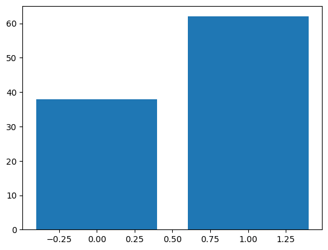
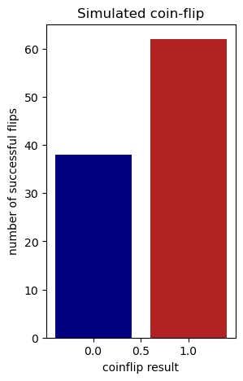
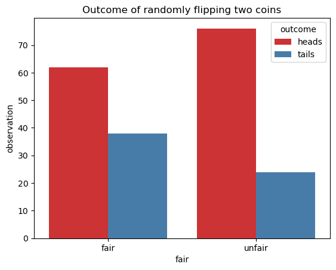

# Learning python 

## How do you use python?

Writing in python can be accessed from a multitude of locations. Three major locations are:
- Terminal for an interactive terminal session for quick commands
- Jupyter notebook, where code entered and quickly visualized
- Running `.py` scripts, which allows for greater and better use of computational resources

### Using terminal

On most systems, including VSCode on Biowulf, you can access python via terminal simply by typing `python`. A prompt will appear with three arrows `>>>` where python code will be entered. There is memory of the previous lines in this kind of an interactive session, but that memory does not carry between sessions. Any data that needs to be saved must be written out to a file. Additionally, figures can not be displayed unless saved, limiting interactivity. 

TL;DR using Python in terminal is good for quick tests and calculations.

### Using Jupyter notebooks

Juptyer notebooks are more interactive methods of saving both what you wrote and the output that can be saved as a .html, markdown, or pdf file. Notebooks are broken into a series of cells with one or many lines of code than remember the previous cell. As well, when you plot a figure in Jupyter the cell below shows that plot (which you will see because this page is actually a Juptyer notebook). 

Adding to its use, Jupyter notebooks can also run:
- Julia (**Ju**pyter)
- Terminal (Jupy**te**r)
- R (Jupyte**r**)
- Markdown (how this cell is being written)

I recommend trying new methods and performing data analysis in Juptyer notebooks, but don't save them for external use.

### Writing python scripts

Once you get a certain methodology working in your Jupyter notebooks, save that code into a more efficient Python `.py` script. While Jupyter notebooks are fun, they don't handle resources efficently or can be easily run in parallel. A good Python script can easily take an input file, perform some calculation, and give a result. I prefer to break steps down into manageable small scripts and string them together with [snakemake](snakemake.md). In addition, python scripts can be used in [singularity containers](singularity_page.md) to give reproducible outputs.

TL;DR use Python scripts for resource intensive, reproducible, repetitious tasks.

## What can python do?

### Variables and functions

No matter what language you are working with, you need to be able to see your output. Most of the output will be in the form of ASCII characters, unless you are producing an output of figures or graphs (which will still have underlying ASCII characters that are interpreted as an image). This is why its important to know how you output a set of characters, traditionally by saying `Hello World!`. This is done using the python `print` command.


```python
print('Hello world!')
```

    Hello world!


When you run Juptyer notebook for the first time, it will ask for a Python kernel to use. Use the one we made in the [Anaconda](anaconda.md) section as it has packages installed that will be necessary in this section.

`print` is actually a function, built-in to python and available in Python 3. There are many functions built into Python, which 


In Python 2 `print` is statement, but unless necessary we will use Python 3 going forward.  

Python also can create arrays of data, either in lists [], tuples (), dictionaries {}, or sets {}. For brevity, we will stick to lists


```python
a = [1, 2, 3]
```

Once the variable `a` has been assigned the value of the following list, we can execute the cell just with the variable `a` to return the result:


```python
a
```


    [1, 2, 3]


Let's define a second list


```python
b = [2, 3, 4]
b
```


    [2, 3, 4]


Lists can be appended to one another. When we add `b` to `a`, defining `c`, we get the concatenation of `b` and `a` (order matters).


```python
c = a + b
c
```


    [1, 2, 3, 2, 3, 4]


For any variable, if we don't know what kind it is, we can use the function `type` to return the name of the type of variable.


```python
type(a)
```


    list


If the value in a list is needed, we can **slice** out that value using brackets. 

**Important**: Python is 0-indexed, meaning the first item in a list is the 0th item, the second item is the 1st item, and so on.


```python
a[1]
```


    2


### Manipulating strings

As bioinformatics deals with a lot of nucleotides as characters, manipulating string-type variables is quite useful.


```python
first_sentence = 'Hello world!'
```

As we can see it is of the type `str`.


```python
type(first_sentence)
```


    str


Sometimes it is useful to convert numerical values to strings. We can assign the variable `d` the value of `4`.


```python
d = 4
type(d)
```


    int


`str` operates as function, turning the value within to the type `str`.


```python
e = str(d)
type(e)
```


    str


We can add strings together, just as we did with lists. Let's define `new_word` as the string `Again!`.


```python
new_word = 'Again!'
```

Adding the two strings together gives a new string.


```python
second_sentence = first_sentence + new_word
second_sentence
```


    'Hello world!Again!'


In addition to adding strings together, we can also slice out characters or words as we would with a list. To get the first two letters of the string `new_word`:


```python
new_word_slice = new_word[0:2]
new_word_slice
```


    'Ag'


Appending and slicing strings becomes very important for `.fasta` parsing.

### Loops

It is often useful to loop through items of a list (or a string). We do this by saying `for` an element in some `list`. To return a simple list of integers we can use the `range` function:


```python
for i in range(3):
    print(i)
```

    0
    1
    2


Looping through a list looks like:


```python
for number in a:
    print(number)
```

    1
    2
    3


If we wanted to loop for an indefinite amount of time, we can use a `while` loop, which will go on forever until some condition is met.


```python
stop = 0
while stop < 5:
    # Add one value to stop
    stop += 1
    print(stop)
```

    1
    2
    3
    4
    5


## A bioinformatic example

Using these fundamentals, let's apply Python to a biological question. 

Suppose we wanted a list of every possible codon sequence (just in DNA).

First we would define what is a nucleotide, the subunit of a codon.


```python
# Define nucleotides
nucs = ['A', 'T', 'C', 'G']
```

Next we loop through all possible nucleotides at all three positions.


```python
for first_nuc in nucs:
    for second_nuc in nucs:
        for third_nuc in nucs:
            print(first_nuc + second_nuc + third_nuc)
```

    AAA
    AAT
    AAC
    AAG
    ATA
    ATT
    ATC
    ATG
    ACA
    ACT
    ACC
    ACG
    AGA
    AGT
    AGC
    AGG
    TAA
    TAT
    TAC
    TAG
    TTA
    TTT
    TTC
    TTG
    TCA
    TCT
    TCC
    TCG
    TGA
    TGT
    TGC
    TGG
    CAA
    CAT
    CAC
    CAG
    CTA
    CTT
    CTC
    CTG
    CCA
    CCT
    CCC
    CCG
    CGA
    CGT
    CGC
    CGG
    GAA
    GAT
    GAC
    GAG
    GTA
    GTT
    GTC
    GTG
    GCA
    GCT
    GCC
    GCG
    GGA
    GGT
    GGC
    GGG


Printing out the result isn't always the most useful. Suppose we want to save the codons in a list. If we want to save the codon strings for later, we need to save the string to to a list with the `append` **method**. 

**Methods** are a way of saying what actions a variable can do, and similarly **attributes** are what defines a variable. Together they allow for variables to interact with other variables.


```python
# Define the empty list
codon_list = []

# Loop through and add new codons to the list
for first_nuc in nucs:
    for second_nuc in nucs:
        for third_nuc in nucs:
            codon_list.append(first_nuc + second_nuc + third_nuc)
```

If you don't want to take time and space rewriting code, **functions** allow for taking in one, some, or none variables and returning some other variables. For our codon table example:


```python
def give_codon_table():
    codon_list = []
    for first_nuc in nucs:
        for second_nuc in nucs:
            for third_nuc in nucs:
                codon_list.append(f'{first_nuc}{second_nuc}{third_nuc}')
    return codon_list
```

Now we can get a list of codons just by calling `give_codon_table`. The output can be assigned to a new variable `codon_table`. 

As this list is pretty long, to save space we can ask how many elements are in a variable with the `len` function, and we can inspect the first five items by slicing.


```python
codon_table = give_codon_table()
len(codon_table), codon_table[:5]
```


    (64, ['AAA', 'AAT', 'AAC', 'AAG', 'ATA'])


### Using modules

From a biology perspective, we know that the codons for the 0th and 3rd codons are different, but they both code for the same amino acid Lysine. In python we can define two variable are the same by using the **operator** `==` (like `+`, `-`, `=`, `<`, `>`), returning if it is the boolean value `True` or `False`.


```python
codon_list[0]
```


    'AAA'


```python
codon_list[3]
```


    'AAG'


Knowing these two strings are different, we see that comparing them results in `False`.


```python
codon_list[0] == codon_list[3]
```


    False


While we could go through the trouble of building a table of codon to amino acid values, we are not the first people to think of this.

One of the greatest strengths in Python is the large number of packages and modules that can answer questions we have. This becomes a problem if your desire is to write code no one else has done before, but that is outside the scope of this lesson.

[`Biopython`](https://biopython.org/) is an amazing package with a lot of the fundamental tools for handling bioinformatic data. It isn't great for everything, but it has good fundamentals. In the previous [Anaconda](anaconda.md) section we made an environment that had Biopython installed, now we can load it with:


```python
from Bio import Seq
```

The `Seq` module in the `Bio` (Biopython) package is really a **class** object that can have **methods** applied to it. For more information type `help(Seq)`.

We can define `codon_1` as a `Seq` object with the property of it's `Seq` being the 0th string in the codon list.


```python
codon_1 = Seq.Seq(codon_list[0])
type(codon_1), codon_1
```


    (Bio.Seq.Seq, Seq('AAA'))


The codon object can be translated into it's amino acid using the `.translate()` method.


```python
amino_acid_1 = codon_1.translate()
```

Resulting in objects `codon_1` and `amino_acid_1`.


```python
str(codon_1), str(amino_acid_1)
```


    ('AAA', 'K')


This can be done again with the 3rd codon.


```python
codon_2 = Seq.Seq(codon_list[3])
amino_acid_2 = codon_2.translate()
str(codon_2), str(amino_acid_2)
```


    ('AAG', 'K')


Again we confirm the codons are different.


```python
str(codon_1) == str(codon_2)
```


    False


But we see that the amino acids are the same!


```python
str(amino_acid_1) == str(amino_acid_2)
```


    True


One can imagine this can be applied at a higher level for translating great unknown sequences from metagenomic data, or calculating dN/dS ratios from Coronavirus populations. These packages may already be out there. But use these tools to play with data and ideas and who knows what you will discover!

### I/O 

While the function we have made for creating amino acids is useful and quick, it does not exist outside of this notebook. To save this data we can use the `write` method after opening a new file with the `open` function.


```python
# Open a new file to write to with the 'w' flag
with open('../data/codon_list.txt', 'w') as f:
    # Loop through codons
    for codon in codon_list:
        # Write the codon
        f.write(codon)
        f.write('\n')
    # Always good to close files to prevent memory leaks
    f.close()
```

We can use the `open` function with the read `r` flag to now open the file.


```python
# Let's open that file up

# Define new list to store data
new_codon_list = []
with open('../data/codon_list.txt', 'r') as f:
    for line in f.readlines():
        new_codon_list.append(line)
    f.close()
new_codon_list[:5]
```


    ['AAA\n', 'AAT\n', 'AAC\n', 'AAG\n', 'ATA\n']


However the `newline` character is read in as well, even if we don't see it in the file. We can remove it with the `strip` method.


```python
# Let's open that file up, with removed 

# Define new list to store data
new_codon_list = []
with open('../data/codon_list.txt', 'r') as f:
    for line in f.readlines():
        line = line.strip()
        new_codon_list.append(line)
    f.close()
new_codon_list[:5]
```


    ['AAA', 'AAT', 'AAC', 'AAG', 'ATA']


## Scientific computation

A cornerstone of bioinformatics is quantitative analysis. `Numpy`, amongst `Scipy`, `Sklearn`, `Matplotlib`, `Seaborn`, and `Pandas`, serves as the bedrock for efficent, reproducible code.


```python
import numpy as np
```

Remember we defined our first variable `a`, a list.


```python
a
```


    [1, 2, 3]


`Numpy` arrays are like lists, but with linear algebra capability. Lists can be converted to arrays:


```python
a_np = np.array(a)
a_np
```


    array([1, 2, 3])


With a list if we multiple it 3 times, we make 3 copies.


```python
a * 3
```


    [1, 2, 3, 1, 2, 3, 1, 2, 3]


With an array if we multiple it 3 times, we multiple each value by 3.


```python
a_np * 3
```


    array([3, 6, 9])


A much deeper dive into the full linear algebra capabilities is out of the scope of this lesson, but truly it is one of the best methods for performing these computations.

### Randomness

Of the many modules in `Numpy` is it's random number generator. Endless mathematicians have been fascinated by randomness, and it plays an important part in biology as well. 

With the `random` module we can get a random number between 0 and 1 easily:


```python
np.random.random()
```


    0.308979932712822


For that matter we can get 5!


```python
np.random.random(5)
```


    array([0.87015478, 0.5240611 , 0.43159515, 0.8005946 , 0.41942209])


We can also sample a bionomial distribution.

Suppose we wanted to simulate flipping a fair (50%) coin (don't dive too deep into what is a [fair coin](https://arxiv.org/abs/2310.04153)). We can use the `binomial` function 100 times for a value of 1 (heads) or 0 (tails).


```python
fair_coin = np.random.binomial(n=1, p=.5, size=100)
fair_coin
```


    array([0, 1, 0, 1, 0, 0, 1, 1, 1, 0, 0, 1, 1, 1, 1, 0, 0, 1, 0, 1, 1, 1,
           1, 1, 1, 1, 0, 1, 1, 0, 1, 1, 1, 1, 0, 0, 1, 1, 1, 0, 1, 1, 1, 1,
           1, 1, 1, 0, 0, 1, 0, 1, 1, 1, 1, 0, 1, 0, 1, 0, 1, 1, 1, 0, 1, 1,
           0, 0, 1, 0, 1, 0, 0, 1, 1, 1, 1, 1, 0, 0, 0, 1, 0, 1, 0, 1, 1, 1,
           0, 1, 1, 1, 0, 0, 0, 0, 1, 1, 0, 0])


We can easily get the number of heads by getting a sum of the 1s, and subtracting from the total number of flips.


```python
heads_count = sum(fair_coin)
tails_count = 100 - sum(fair_coin)
heads_count, tails_count
```


    (np.int64(62), np.int64(38))


This is nice, but there is a limit of how many lists and tables we would want to present. `Matplotlib` is a wonderful and endlessly customizable package for plotting data.


```python
import matplotlib.pyplot as plt
```

Using the function `bar` to create a barplot.


```python
plt.bar([0, 1], [tails_count, heads_count])
```


    <BarContainer object of 2 artists>


    

    


Again that is nice, but not a figure we would see in Nature. Let's add some fun color, label our axes, and give a title.


```python
plt.figure(figsize=(3, 5))
plt.bar(x = [0, 1], height = [tails_count, heads_count], label=['tails', 'heads'], color=['navy', 'firebrick'])
plt.ylabel('number of successful flips')
plt.xlabel('coinflip result')
plt.title('Simulated coin-flip')
plt.savefig('coin_flip_figure.png')
```


    

    


That looks better!

## Pandas-seaborn

Suppose we want to simulate a fair (50% heads) and unfair (75% heads) coins. We can make a second list of unfair coins and compare.


```python
fair_coin
```


    array([0, 1, 0, 1, 0, 0, 1, 1, 1, 0, 0, 1, 1, 1, 1, 0, 0, 1, 0, 1, 1, 1,
           1, 1, 1, 1, 0, 1, 1, 0, 1, 1, 1, 1, 0, 0, 1, 1, 1, 0, 1, 1, 1, 1,
           1, 1, 1, 0, 0, 1, 0, 1, 1, 1, 1, 0, 1, 0, 1, 0, 1, 1, 1, 0, 1, 1,
           0, 0, 1, 0, 1, 0, 0, 1, 1, 1, 1, 1, 0, 0, 0, 1, 0, 1, 0, 1, 1, 1,
           0, 1, 1, 1, 0, 0, 0, 0, 1, 1, 0, 0])


```python
unfair_coin = np.random.binomial(n=1, p=.75, size=100)
unfair_coin
```


    array([1, 0, 1, 1, 1, 1, 1, 0, 0, 1, 0, 1, 1, 1, 1, 0, 1, 1, 1, 1, 1, 0,
           0, 1, 1, 1, 0, 1, 1, 1, 1, 1, 1, 1, 1, 1, 0, 1, 1, 1, 1, 1, 0, 1,
           1, 0, 0, 0, 0, 1, 0, 1, 1, 1, 0, 1, 0, 1, 1, 1, 1, 1, 1, 1, 1, 1,
           1, 1, 1, 0, 1, 1, 1, 1, 0, 1, 1, 1, 1, 1, 0, 0, 0, 1, 1, 0, 0, 1,
           1, 1, 1, 1, 1, 1, 1, 1, 1, 1, 1, 1])


Keeping track of two separate data sets is hard, let's use the principle of tidy data and `Pandas` to combine the data into a readable DataFrame.


```python
import pandas as pd
```

We can convert the numpy arrays into a DataFrame with each flip annotated.


```python
fair_coin_df = pd.DataFrame(
    {
        'observation': fair_coin, 
        'fair': 'fair'
        }
    )
fair_coin_df.head()
```


<div>
<style scoped>
    .dataframe tbody tr th:only-of-type {
        vertical-align: middle;
    }

    .dataframe tbody tr th {
        vertical-align: top;
    }

    .dataframe thead th {
        text-align: right;
    }
</style>
<table border="1" class="dataframe">
  <thead>
    <tr style="text-align: right;">
      <th></th>
      <th>observation</th>
      <th>fair</th>
    </tr>
  </thead>
  <tbody>
    <tr>
      <th>0</th>
      <td>0</td>
      <td>fair</td>
    </tr>
    <tr>
      <th>1</th>
      <td>1</td>
      <td>fair</td>
    </tr>
    <tr>
      <th>2</th>
      <td>0</td>
      <td>fair</td>
    </tr>
    <tr>
      <th>3</th>
      <td>1</td>
      <td>fair</td>
    </tr>
    <tr>
      <th>4</th>
      <td>0</td>
      <td>fair</td>
    </tr>
  </tbody>
</table>
</div>


And again to the unfair coin DataFrame


```python
unfair_coin_df = pd.DataFrame(
    {
        'observation': unfair_coin, 
        'fair': 'unfair'
        }
    )
unfair_coin_df.head()
```


<div>
<style scoped>
    .dataframe tbody tr th:only-of-type {
        vertical-align: middle;
    }

    .dataframe tbody tr th {
        vertical-align: top;
    }

    .dataframe thead th {
        text-align: right;
    }
</style>
<table border="1" class="dataframe">
  <thead>
    <tr style="text-align: right;">
      <th></th>
      <th>observation</th>
      <th>fair</th>
    </tr>
  </thead>
  <tbody>
    <tr>
      <th>0</th>
      <td>1</td>
      <td>unfair</td>
    </tr>
    <tr>
      <th>1</th>
      <td>0</td>
      <td>unfair</td>
    </tr>
    <tr>
      <th>2</th>
      <td>1</td>
      <td>unfair</td>
    </tr>
    <tr>
      <th>3</th>
      <td>1</td>
      <td>unfair</td>
    </tr>
    <tr>
      <th>4</th>
      <td>1</td>
      <td>unfair</td>
    </tr>
  </tbody>
</table>
</div>


If the columns are the same, DataFrames can be concatenated (just make sure the metadata is there!)


```python
coin_df = pd.concat([fair_coin_df, unfair_coin_df])
```

The `.info()` method retuns the information about the DataFrame.


```python
coin_df.info()
```

    <class 'pandas.DataFrame'>
    Index: 200 entries, 0 to 99
    Data columns (total 2 columns):
     #   Column       Non-Null Count  Dtype
    ---  ------       --------------  -----
     0   observation  200 non-null    int64
     1   fair         200 non-null    str  
    dtypes: int64(1), str(1)
    memory usage: 4.7 KB


Just like arrays, lists, and strings, we can slice out which values we want.


```python
coin_df[coin_df['fair'] == 'fair'].head()
```


<div>
<style scoped>
    .dataframe tbody tr th:only-of-type {
        vertical-align: middle;
    }

    .dataframe tbody tr th {
        vertical-align: top;
    }

    .dataframe thead th {
        text-align: right;
    }
</style>
<table border="1" class="dataframe">
  <thead>
    <tr style="text-align: right;">
      <th></th>
      <th>observation</th>
      <th>fair</th>
    </tr>
  </thead>
  <tbody>
    <tr>
      <th>0</th>
      <td>0</td>
      <td>fair</td>
    </tr>
    <tr>
      <th>1</th>
      <td>1</td>
      <td>fair</td>
    </tr>
    <tr>
      <th>2</th>
      <td>0</td>
      <td>fair</td>
    </tr>
    <tr>
      <th>3</th>
      <td>1</td>
      <td>fair</td>
    </tr>
    <tr>
      <th>4</th>
      <td>0</td>
      <td>fair</td>
    </tr>
  </tbody>
</table>
</div>


Or get summary values quickly.


```python
coin_df.groupby(['observation', 'fair']).sum()
```


<div>
<style scoped>
    .dataframe tbody tr th:only-of-type {
        vertical-align: middle;
    }

    .dataframe tbody tr th {
        vertical-align: top;
    }

    .dataframe thead th {
        text-align: right;
    }
</style>
<table border="1" class="dataframe">
  <thead>
    <tr style="text-align: right;">
      <th></th>
      <th></th>
    </tr>
    <tr>
      <th>observation</th>
      <th>fair</th>
    </tr>
  </thead>
  <tbody>
    <tr>
      <th rowspan="2" valign="top">0</th>
      <th>fair</th>
    </tr>
    <tr>
      <th>unfair</th>
    </tr>
    <tr>
      <th rowspan="2" valign="top">1</th>
      <th>fair</th>
    </tr>
    <tr>
      <th>unfair</th>
    </tr>
  </tbody>
</table>
</div>


`Pandas` works well with the package `Seaborn`, which creates beautiful figures easily.


```python
import seaborn as sns
```


```python
outcome_dict = {1: 'heads', 0: 'tails'}
coin_df['outcome'] = [outcome_dict[x] for x in coin_df['observation']]
coin_df.head()
```


<div>
<style scoped>
    .dataframe tbody tr th:only-of-type {
        vertical-align: middle;
    }

    .dataframe tbody tr th {
        vertical-align: top;
    }

    .dataframe thead th {
        text-align: right;
    }
</style>
<table border="1" class="dataframe">
  <thead>
    <tr style="text-align: right;">
      <th></th>
      <th>observation</th>
      <th>fair</th>
      <th>outcome</th>
    </tr>
  </thead>
  <tbody>
    <tr>
      <th>0</th>
      <td>0</td>
      <td>fair</td>
      <td>tails</td>
    </tr>
    <tr>
      <th>1</th>
      <td>1</td>
      <td>fair</td>
      <td>heads</td>
    </tr>
    <tr>
      <th>2</th>
      <td>0</td>
      <td>fair</td>
      <td>tails</td>
    </tr>
    <tr>
      <th>3</th>
      <td>1</td>
      <td>fair</td>
      <td>heads</td>
    </tr>
    <tr>
      <th>4</th>
      <td>0</td>
      <td>fair</td>
      <td>tails</td>
    </tr>
  </tbody>
</table>
</div>


```python
coin_df.groupby(['outcome', 'fair']).count().reset_index()
```


<div>
<style scoped>
    .dataframe tbody tr th:only-of-type {
        vertical-align: middle;
    }

    .dataframe tbody tr th {
        vertical-align: top;
    }

    .dataframe thead th {
        text-align: right;
    }
</style>
<table border="1" class="dataframe">
  <thead>
    <tr style="text-align: right;">
      <th></th>
      <th>outcome</th>
      <th>fair</th>
      <th>observation</th>
    </tr>
  </thead>
  <tbody>
    <tr>
      <th>0</th>
      <td>heads</td>
      <td>fair</td>
      <td>62</td>
    </tr>
    <tr>
      <th>1</th>
      <td>heads</td>
      <td>unfair</td>
      <td>76</td>
    </tr>
    <tr>
      <th>2</th>
      <td>tails</td>
      <td>fair</td>
      <td>38</td>
    </tr>
    <tr>
      <th>3</th>
      <td>tails</td>
      <td>unfair</td>
      <td>24</td>
    </tr>
  </tbody>
</table>
</div>


```python
sns.barplot(
    data = coin_df.groupby(['outcome', 'fair']).count().reset_index(),
    y = 'observation',
    hue = 'outcome',
    x = 'fair',
    palette = 'Set1'
)
plt.title('Outcome of randomly flipping two coins')
```


    Text(0.5, 1.0, 'Outcome of randomly flipping two coins')


    

    


And we can easily save and read our data in .csv format easily and quickly.


```python
coin_df.to_csv('../data/coin_data.csv', sep=',', index=False)
```


```python
coin_df = pd.read_csv('../data/coin_data.csv')
coin_df.head()
```


<div>
<style scoped>
    .dataframe tbody tr th:only-of-type {
        vertical-align: middle;
    }

    .dataframe tbody tr th {
        vertical-align: top;
    }

    .dataframe thead th {
        text-align: right;
    }
</style>
<table border="1" class="dataframe">
  <thead>
    <tr style="text-align: right;">
      <th></th>
      <th>observation</th>
      <th>fair</th>
    </tr>
  </thead>
  <tbody>
    <tr>
      <th>0</th>
      <td>0</td>
      <td>fair</td>
    </tr>
    <tr>
      <th>1</th>
      <td>1</td>
      <td>fair</td>
    </tr>
    <tr>
      <th>2</th>
      <td>0</td>
      <td>fair</td>
    </tr>
    <tr>
      <th>3</th>
      <td>1</td>
      <td>fair</td>
    </tr>
    <tr>
      <th>4</th>
      <td>0</td>
      <td>fair</td>
    </tr>
  </tbody>
</table>
</div>


