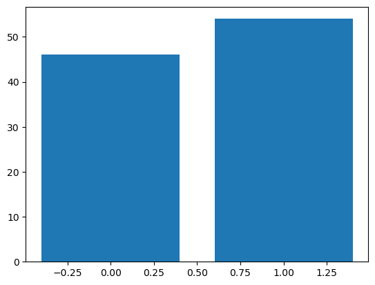
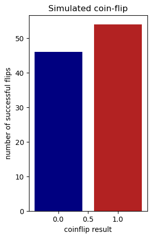

# Learning python 

## How do you use python?

Writing in python can be accessed from a multitude of locations. Three major locations are:
- Terminal for an interactive terminal session for quick commands
- Jupyter notebook, where code entered and quickly visualized
- Running `.py` scripts, which allows for greater and better use of computational resources

### Using terminal

On most systems, including VSCode on Biowulf, you can access python via terminal simply by typing `python`. A prompt will appear with three arrows `>>>` where python code will be entered. There is memory of the previous lines in this kind of an interactive session, but that memory does not carry between sessions. Any data that needs to be saved must be written out to a file. Additionally, figures can not be displayed unless saved, limiting interactivity. 

TL;DR using Python in terminal is good for quick tests and calculations.

### Using Jupyter notebooks

Juptyer notebooks are more interactive methods of saving both what you wrote and the output that can be saved as a .html, markdown, or pdf file. Notebooks are broken into a series of cells with one or many lines of code than remember the previous cell. As well, when you plot a figure in Jupyter the cell below shows that plot (which you will see because this page is actually a Juptyer notebook). 

Adding to its use, Jupyter notebooks can also run:
- Julia (**Ju**pyter)
- Terminal (Jupy**te**r)
- R (Jupyte**r**)
- Markdown (how this cell is being written)

I recommend trying new methods and performing data analysis in Juptyer notebooks, but don't save them for external use.

### Writing python scripts

Once you get a certain methodology working in your Jupyter notebooks, save that code into a more efficient Python `.py` script. While Jupyter notebooks are fun, they don't handle resources efficently or can be easily run in parallel. A good Python script can easily take an input file, perform some calculation, and give a result. I prefer to break steps down into manageable small scripts and string them together with [snakemake](snakemake.md). In addition, python scripts can be used in [singularity containers](singularity_page.md) to give reproducible outputs.

TL;DR use Python scripts for resource intensive, reproducible, repetitious tasks.

## What can python do?

### Variables and functions

No matter what language you are working with, you need to be able to see your output. Most of the output will be in the form of ASCII characters, unless you are producing an output of figures or graphs (which will still have underlying ASCII characters that are interpreted as an image). This is why its important to know how you output a set of characters, traditionally by saying `Hello World!`. This is done using the python `print` command.


```python
print('Hello world!')
```

    Hello world!


`print` is actually a function, built-in to python and available in Python 3. There are many functions built into Python, which 


In Python 2 `print` is statement, but unless necessary we will use Python 3 going forward.  

Python also can create arrays of data, either in lists [], tuples (), dictionaries {}, or sets {}. For brevity, we will stick to lists


```python
a = [1, 2, 3]
```

Once the variable `a` has been assigned the value of the following list, we can execute the cell just with the variable `a` to return the result:


```python
a
```


    [1, 2, 3]


Let's define a second list


```python
b = [2, 3, 4]
b
```


    [2, 3, 4]


Lists can be appended to one another. When we add `b` to `a`, defining `c`, we get the concatenation of `b` and `a` (order matters).


```python
c = a + b
c
```


    [1, 2, 3, 2, 3, 4]


For any variable, if we don't know what kind it is, we can use the function `type` to return the name of the type of variable.


```python
type(a)
```


    list


If the value in a list is needed, we can **slice** out that value using brackets. 

**Important**: Python is 0-indexed, meaning the first item in a list is the 0th item, the second item is the 1st item, and so on.


```python
a[1]
```


    2


### Manipulating strings

As bioinformatics deals with a lot of nucleotides as characters, manipulating string-type variables is quite useful.


```python
first_sentence = 'Hello world!'
```

As we can see it is of the type `str`.


```python
type(first_sentence)
```


    str


Sometimes it is useful to convert numerical values to strings. We can assign the variable `d` the value of `4`.


```python
d = 4
type(d)
```


    int


`str` operates as function, turning the value within to the type `str`.


```python
e = str(d)
type(e)
```


    str


We can add strings together, just as we did with lists. Let's define `new_word` as the string `Again!`.


```python
new_word = 'Again!'
```

Adding the two strings together gives a new string.


```python
second_sentence = first_sentence + new_word
second_sentence
```


    'Hello world!Again!'


In addition to adding strings together, we can also slice out characters or words as we would with a list. To get the first two letters of the string `new_word`:


```python
new_word_slice = new_word[0:2]
new_word_slice
```


    'Ag'


Appending and slicing strings becomes very important for `.fasta` parsing.

### Loops

It is often useful to loop through items of a list (or a string). We do this by saying `for` an element in some `list`. To return a simple list of integers we can use the `range` function:


```python
for i in range(3):
    print(i)
```

    0
    1
    2


Looping through a list looks like:


```python
for number in a:
    print(number)
```

    1
    2
    3


If we wanted to loop for an indefinite amount of time, we can use a `while` loop, which will go on forever until some condition is met.


```python
stop = 0
while stop < 5:
    # Add one value to stop
    stop += 1
    print(stop)
```

    1
    2
    3
    4
    5


## A bioinformatic example

Using these fundamentals, let's apply Python to a biological question. 

Suppose we wanted a list of every possible codon sequence (just in DNA).

First we would define what is a nucleotide, the subunit of a codon.


```python
# Define nucleotides
nucs = ['A', 'T', 'C', 'G']
```

Next we loop through all possible nucleotides at all three positions.


```python
for first_nuc in nucs:
    for second_nuc in nucs:
        for third_nuc in nucs:
            print(first_nuc + second_nuc + third_nuc)
```

    AAA
    AAT
    AAC
    AAG
    ATA
    ATT
    ATC
    ATG
    ACA
    ACT
    ACC
    ACG
    AGA
    AGT
    AGC
    AGG
    TAA
    TAT
    TAC
    TAG
    TTA
    TTT
    TTC
    TTG
    TCA
    TCT
    TCC
    TCG
    TGA
    TGT
    TGC
    TGG
    CAA
    CAT
    CAC
    CAG
    CTA
    CTT
    CTC
    CTG
    CCA
    CCT
    CCC
    CCG
    CGA
    CGT
    CGC
    CGG
    GAA
    GAT
    GAC
    GAG
    GTA
    GTT
    GTC
    GTG
    GCA
    GCT
    GCC
    GCG
    GGA
    GGT
    GGC
    GGG


Printing out the result isn't always the most useful. Suppose we want to save the codons in a list. If we want to save the codon strings for later, we need to save the string to to a list with the `append` **method**. 

**Methods** are a way of saying what actions a variable can do, and similarly **attributes** are what defines a variable. Together they allow for variables to interact with other variables.


```python
# Define the empty list
codon_list = []

# Loop through and add new codons to the list
for first_nuc in nucs:
    for second_nuc in nucs:
        for third_nuc in nucs:
            codon_list.append(first_nuc + second_nuc + third_nuc)
```

If you don't want to take time and space rewriting code, **functions** allow for taking in one, some, or none variables and returning some other variables. For our codon table example:


```python
def give_codon_table():
    codon_list = []
    for first_nuc in nucs:
        for second_nuc in nucs:
            for third_nuc in nucs:
                codon_list.append(f'{first_nuc}{second_nuc}{third_nuc}')
    return codon_list
```

Now we can get a list of codons just by calling `give_codon_table`. The output can be assigned to a new variable `codon_table`. 

As this list is pretty long, to save space we can ask how many elements are in a variable with the `len` function, and we can inspect the first five items by slicing.


```python
codon_table = give_codon_table()
len(codon_table), codon_table[:5]
```


    (64, ['AAA', 'AAT', 'AAC', 'AAG', 'ATA'])


```python
import my_functions
```


```python
help(my_functions)
```

    Help on module my_functions:
    
    NAME
        my_functions - # Define nucleotides
    
    FUNCTIONS
        give_codon_table()
    
    DATA
        nucs = ['A', 'T', 'C', 'G']
    
    FILE
        /vf/users/CARD_singlecell/users/catchingba/VSCode/scripts/my_functions.py
    
    


```python
my_codon_table = my_functions.give_codon_table()
len(my_codon_table), my_codon_table[:5]
```


    ['AAA',
     'AAT',
     'AAC',
     'AAG',
     'ATA',
     'ATT',
     'ATC',
     'ATG',
     'ACA',
     'ACT',
     'ACC',
     'ACG',
     'AGA',
     'AGT',
     'AGC',
     'AGG',
     'TAA',
     'TAT',
     'TAC',
     'TAG',
     'TTA',
     'TTT',
     'TTC',
     'TTG',
     'TCA',
     'TCT',
     'TCC',
     'TCG',
     'TGA',
     'TGT',
     'TGC',
     'TGG',
     'CAA',
     'CAT',
     'CAC',
     'CAG',
     'CTA',
     'CTT',
     'CTC',
     'CTG',
     'CCA',
     'CCT',
     'CCC',
     'CCG',
     'CGA',
     'CGT',
     'CGC',
     'CGG',
     'GAA',
     'GAT',
     'GAC',
     'GAG',
     'GTA',
     'GTT',
     'GTC',
     'GTG',
     'GCA',
     'GCT',
     'GCC',
     'GCG',
     'GGA',
     'GGT',
     'GGC',
     'GGG']


```python
codon_list[0]
```


    'AAA'


```python
codon_list[3]
```


    'AAG'


```python
codon_list[0] == codon_list[3]
```


    False


```python
from Bio import Seq
```


```python
codon_1 = Seq.Seq(codon_list[0])
amino_acid_1 = codon_1.translate()
type(codon_1), codon_1, amino_acid_1
```


    (Bio.Seq.Seq, Seq('AAA'), Seq('K'))


```python
str(codon_1), str(amino_acid_1)
```


    ('AAA', 'K')


```python
codon_2 = Seq.Seq(codon_list[3])
amino_acid_2 = codon_2.translate()
str(codon_2), str(amino_acid_2)
```


    ('AAG', 'K')


```python
str(codon_1) == str(codon_2)
```


    False


```python
str(amino_acid_1) == str(amino_acid_2)
```


    True


# I/O 


```python
# Want to save codon_list to a file
with open('../data/codon_list.txt', 'w') as f:
    for codon in codon_list:
        f.write(codon)
        f.write('\n')
    f.close()
```


```python
# Let's open that file up

# Define new list to store data
new_codon_list = []
with open('../data/codon_list.txt', 'r') as f:
    for line in f.readlines():
        new_codon_list.append(line)
    f.close()
new_codon_list[:5]
```


    ['AAA\n', 'AAT\n', 'AAC\n', 'AAG\n', 'ATA\n']


```python
# Let's open that file up, with removed 

# Define new list to store data
new_codon_list = []
with open('../data/codon_list.txt', 'r') as f:
    for line in f.readlines():
        line = line.strip()
        new_codon_list.append(line)
    f.close()
new_codon_list[:5]
```


    ['AAA', 'AAT', 'AAC', 'AAG', 'ATA']


# Scientific computation


```python
import numpy as np
```


```python
a
```


    [1, 2, 3]


```python
a_np = np.array(a)
a_np
```


    array([1, 2, 3])


```python
a * 3
```


    [1, 2, 3, 1, 2, 3, 1, 2, 3]


```python
a_np * 3
```


    array([3, 6, 9])


```python
np.random.random()
```


    0.2054575996944128


```python
np.random.random(5)
```


    array([0.21256245, 0.44389484, 0.86496341, 0.74561284, 0.31873175])


```python
help(np.random.binomial)
```

    Help on method binomial in module numpy.random:
    
    binomial(n, p, size=None) method of numpy.random.mtrand.RandomState instance
        binomial(n, p, size=None)
        
        Draw samples from a binomial distribution.
        
        Samples are drawn from a binomial distribution with specified
        parameters, n trials and p probability of success where
        n an integer >= 0 and p is in the interval [0,1]. (n may be
        input as a float, but it is truncated to an integer in use)
        
        .. note::
            New code should use the `~numpy.random.Generator.binomial`
            method of a `~numpy.random.Generator` instance instead;
            please see the :ref:`random-quick-start`.
        
        Parameters
        ----------
        n : int or array_like of ints
            Parameter of the distribution, >= 0. Floats are also accepted,
            but they will be truncated to integers.
        p : float or array_like of floats
            Parameter of the distribution, >= 0 and <=1.
        size : int or tuple of ints, optional
            Output shape.  If the given shape is, e.g., ``(m, n, k)``, then
            ``m * n * k`` samples are drawn.  If size is ``None`` (default),
            a single value is returned if ``n`` and ``p`` are both scalars.
            Otherwise, ``np.broadcast(n, p).size`` samples are drawn.
        
        Returns
        -------
        out : ndarray or scalar
            Drawn samples from the parameterized binomial distribution, where
            each sample is equal to the number of successes over the n trials.
        
        See Also
        --------
        scipy.stats.binom : probability density function, distribution or
            cumulative density function, etc.
        random.Generator.binomial: which should be used for new code.
        
        Notes
        -----
        The probability mass function (PMF) for the binomial distribution is
        
        .. math:: P(N) = \binom{n}{N}p^N(1-p)^{n-N},
        
        where :math:`n` is the number of trials, :math:`p` is the probability
        of success, and :math:`N` is the number of successes.
        
        When estimating the standard error of a proportion in a population by
        using a random sample, the normal distribution works well unless the
        product p*n <=5, where p = population proportion estimate, and n =
        number of samples, in which case the binomial distribution is used
        instead. For example, a sample of 15 people shows 4 who are left
        handed, and 11 who are right handed. Then p = 4/15 = 27%. 0.27*15 = 4,
        so the binomial distribution should be used in this case.
        
        References
        ----------
        .. [1] Dalgaard, Peter, "Introductory Statistics with R",
               Springer-Verlag, 2002.
        .. [2] Glantz, Stanton A. "Primer of Biostatistics.", McGraw-Hill,
               Fifth Edition, 2002.
        .. [3] Lentner, Marvin, "Elementary Applied Statistics", Bogden
               and Quigley, 1972.
        .. [4] Weisstein, Eric W. "Binomial Distribution." From MathWorld--A
               Wolfram Web Resource.
               https://mathworld.wolfram.com/BinomialDistribution.html
        .. [5] Wikipedia, "Binomial distribution",
               https://en.wikipedia.org/wiki/Binomial_distribution
        
        Examples
        --------
        Draw samples from the distribution:
        
        >>> n, p = 10, .5  # number of trials, probability of each trial
        >>> s = np.random.binomial(n, p, 1000)
        # result of flipping a coin 10 times, tested 1000 times.
        
        A real world example. A company drills 9 wild-cat oil exploration
        wells, each with an estimated probability of success of 0.1. All nine
        wells fail. What is the probability of that happening?
        
        Let's do 20,000 trials of the model, and count the number that
        generate zero positive results.
        
        >>> sum(np.random.binomial(9, 0.1, 20000) == 0)/20000.
        # answer = 0.38885, or 38%.
    


```python
fair_coin = np.random.binomial(n=1, p=.5, size=100)
fair_coin
```


    array([1, 1, 0, 0, 0, 1, 0, 0, 0, 1, 1, 1, 0, 1, 0, 1, 1, 0, 0, 1, 1, 0,
           1, 1, 1, 1, 1, 0, 1, 1, 0, 1, 1, 0, 1, 0, 0, 0, 0, 1, 0, 1, 1, 0,
           1, 1, 1, 1, 1, 0, 0, 0, 0, 0, 0, 0, 1, 0, 1, 1, 0, 1, 0, 0, 0, 1,
           1, 0, 1, 1, 1, 0, 0, 1, 0, 1, 0, 0, 1, 0, 1, 1, 1, 0, 0, 1, 1, 1,
           1, 0, 1, 0, 0, 1, 1, 1, 1, 0, 0, 1])


```python
heads_count = sum(fair_coin)
tails_count = 100 - sum(fair_coin)
heads_count, tails_count
```


    (np.int64(54), np.int64(46))


```python
import matplotlib.pyplot as plt
```


```python
plt.bar([0, 1], [tails_count, heads_count])
```


    <BarContainer object of 2 artists>


    

    


```python
plt.figure(figsize=(3, 5))
plt.bar(x = [0, 1], height = [tails_count, heads_count], label=['tails', 'heads'], color=['navy', 'firebrick'])
plt.ylabel('number of successful flips')
plt.xlabel('coinflip result')
plt.title('Simulated coin-flip')
plt.savefig('coin_flip_figure.png')
```


    

    


# Pandas-seaborn


```python
fair_coin
```


    array([1, 1, 0, 0, 0, 1, 0, 0, 0, 1, 1, 1, 0, 1, 0, 1, 1, 0, 0, 1, 1, 0,
           1, 1, 1, 1, 1, 0, 1, 1, 0, 1, 1, 0, 1, 0, 0, 0, 0, 1, 0, 1, 1, 0,
           1, 1, 1, 1, 1, 0, 0, 0, 0, 0, 0, 0, 1, 0, 1, 1, 0, 1, 0, 0, 0, 1,
           1, 0, 1, 1, 1, 0, 0, 1, 0, 1, 0, 0, 1, 0, 1, 1, 1, 0, 0, 1, 1, 1,
           1, 0, 1, 0, 0, 1, 1, 1, 1, 0, 0, 1])


```python
unfair_coin = np.random.binomial(n=1, p=.75, size=100)
```


```python
import pandas as pd
```


    ---------------------------------------------------------------------------

    ModuleNotFoundError                       Traceback (most recent call last)

    Cell In[82], line 1
    ----> 1 import pandas as pd


    ModuleNotFoundError: No module named 'pandas'


```python
fair_coin_df = pd.DataFrame({'observation': fair_coin, 'fair': 'fair'*len(fair_coin)})
fair_coin_df.head()
```


    ---------------------------------------------------------------------------

    NameError                                 Traceback (most recent call last)

    Cell In[81], line 1
    ----> 1 pd.DataFrame({'observation': fair_coin, 'fair': 'fair'*len(fair_coin)})


    NameError: name 'pd' is not defined


```python
unfair_coin_df = pd.DataFrame({'observation': unfair_coin, 'fair': 'unfair'*len(unfair_coin)})
```


```python
coin_df = pd.concat([fair_coin, unfair_coin])
```


```python
coin_df.info()
```


```python
coin_df['observation']
```


```python
coin_df[coin_df['fair'] == 'fair']
```


```python
coin_df.groupby(['observation', 'fair']).count()
```


```python
pd.barplot(
    data = coin_df,
    x = 'observation',
    hue = 'fair',
    palette = 'Set1'
)
```


```python
coin_df.to_csv('../data/coin_data.csv', sep=',', index=False)
```


```python
coin_df = pd.read_csv('../data/coin_data.csv')
coin_df.head()
```

# Pull down data


```python
!wget -O /data/CARD_singlecell/users/catchingba/VSCode/data/8e3a.cif https://files.rcsb.org/download/8e3a.cif
```

    --2026-02-10 10:00:10--  https://files.rcsb.org/download/8e3a.cif
    Resolving dtn20-e0 (dtn20-e0)... 10.1.200.74
    Connecting to dtn20-e0 (dtn20-e0)|10.1.200.74|:3128... connected.
    Proxy request sent, awaiting response... 200 OK
    Length: unspecified [chemical/x-cif]
    Saving to: ‘/data/CARD_singlecell/users/catchingba/VSCode/data/8e3a.cif’
    
    /data/CARD_singlece     [ <=>                ] 727.10K  --.-KB/s    in 0.1s    
    
    2026-02-10 10:00:10 (6.13 MB/s) - ‘/data/CARD_singlecell/users/catchingba/VSCode/data/8e3a.cif’ saved [744552]
    

